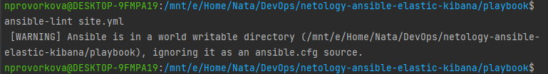

### 8.2 Работа с Playbook - Наталия Проворкова
###### 1. Приготовьте свой собственный inventory файл prod.yml
###### 2. Допишите playbook: нужно сделать ещё один play, который устанавливает и настраивает kibana.
###### 3. При создании tasks рекомендую использовать модули: get_url, template, unarchive, file.
###### 4. Tasks должны: скачать нужной версии дистрибутив, выполнить распаковку в выбранную директорию, сгенерировать конфигурацию с параметрами.
#### 5. Запустите ansible-lint site.yml и исправьте ошибки, если они есть.
sudo apt install dos2unix
 dos2unix site.yml
 ansible-lint site.yml

#### 6. Попробуйте запустить playbook на этом окружении с флагом --check.
docker run --name ubuntu -d pycontribs/ubuntu sleep 65000000
 ansible-playbook -i inventory/prod.yml site.yml --check

