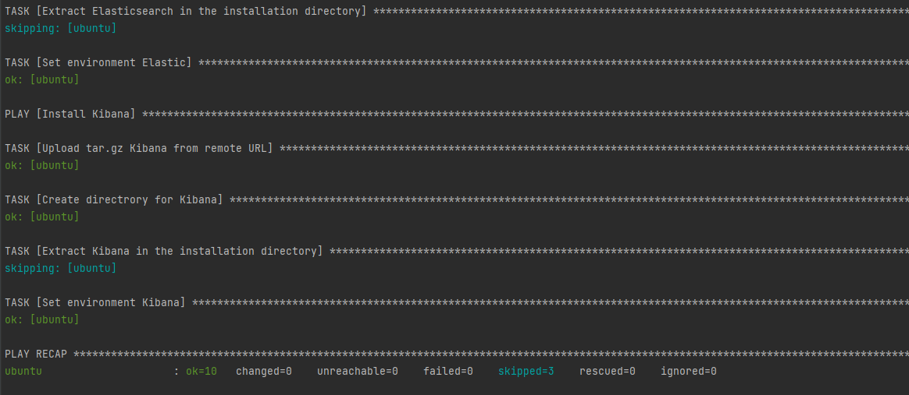

### 8.2 Работа с Playbook - Наталия Проворкова
###### 1. Приготовьте свой собственный inventory файл prod.yml
###### 2. Допишите playbook: нужно сделать ещё один play, который устанавливает и настраивает kibana.
###### 3. При создании tasks рекомендую использовать модули: get_url, template, unarchive, file.
###### 4. Tasks должны: скачать нужной версии дистрибутив, выполнить распаковку в выбранную директорию, сгенерировать конфигурацию с параметрами.
#### 5. Запустите ansible-lint site.yml и исправьте ошибки, если они есть.
sudo apt install dos2unix
 dos2unix site.yml
 ansible-lint site.yml

#### 6. Попробуйте запустить playbook на этом окружении с флагом --check.
docker run --name ubuntu -d pycontribs/ubuntu sleep 65000000
 ansible-playbook -i inventory/prod.yml site.yml --check
 Чек не проходит:

#### 7. Запустите playbook на prod.yml окружении с флагом --diff. Убедитесь, что изменения на системе произведены.
ansible-playbook -i inventory/prod.yml site.yml --diff

#### 8. Повторно запустите playbook с флагом --diff и убедитесь, что playbook идемпотентен.

#### 9. Подготовьте README.md файл по своему playbook. В нём должно быть описано: что делает playbook, какие у него есть параметры и теги.
Playbook 
1. Устанавливает Java:
* Определяет JAVA_HOME
* Загружает ранее скачанный архив с Java на сервер
* Создает директорию JAVA_HOME
* Распаковывает архив и создает дочерние к JAVA_HOME директории /bin/java 
* Экспортирует переменные окружения из шаблона
2. Устанавливает Elasticsearch:
* Скачивает архив Elasticsearch
* Создает директорию ELASTIC_HOME
* Распаковывает архив Elasticsearch
* Экспортирует переменные окружения из шаблона
3. Устанавливает Kibana:
* Скачивает архив Kibana
* Создает директорию KIBANA_HOME
* Распаковывает архив Kibana
* Экспортирует переменные окружения из шаблона

Параметры Playbook:
* java_jdk_version
* java_oracle_jdk_package
* elastic_version
* elastic_home
* kibana_version
* kibana_home

Теги Playbook:
* java
* elastic
* kibana
